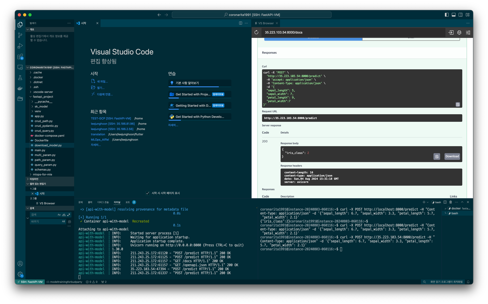
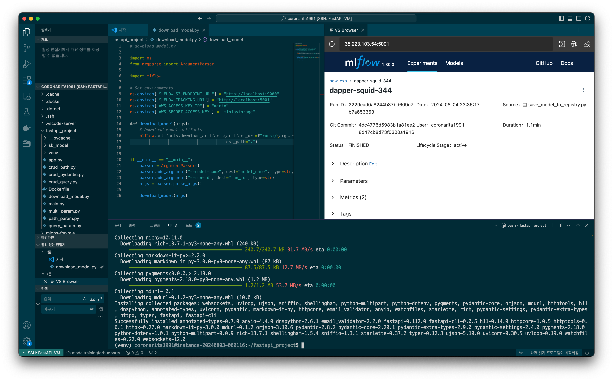

# 요약
    - 기간 : 24. 7. 29. - 8. 5.

# 개요
    이 레포지토리는 MLOps(Machine Learning Operations)를 위한 AIFFEL 실습 자료입니다. 
    MLflow를 사용하여 머신러닝 모델을 관리하고, FastAPI를 사용하여 모델을 서비스하는 방법을 연습하였습니다.

# 주요 내용

	•	MLflow Tracking: 머신러닝 실험을 관리하고 추적합니다.
	•	MLflow Models: 모델을 저장하고 배포합니다.
	•	FastAPI: REST API를 통해 모델 예측 서비스를 제공합니다.
	•	Docker Compose: 여러 컨테이너를 쉽게 관리하고 배포합니다.

# 특이사항
    실습을 위한 교안 참고자료/코드에서는 localhost, 즉 로컬의 자원에서 모든 것을 진행하였습니다.
    본인은, FastAPI 이후의 내용을 GCP에서 VM 인스턴스 생성을 통해 진행하였으며, 본 기회를 통해 클라우드 환경에서의 개발 및 배포에 좀 더 익숙해지고자 하였습니다. 따라서, 일부 코드가 학습 시 참고했던 코드와 상이할 수 있습니다.
    주의해야 할 점은, GCP에서 진행하게 된다면, GCP 내에서의 방화벽 정책을 신경써서 사용하게되는 포트를 열어줘야합니다. 

# 실습 시 캡쳐자료 (GCP의 유동IP가 명시되어 있음)

# 참고자료
https://github.com/mlops-for-mle/mlops-for-mle